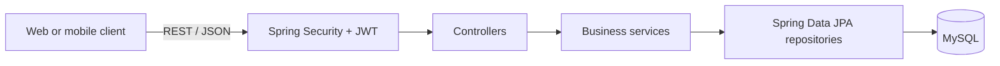
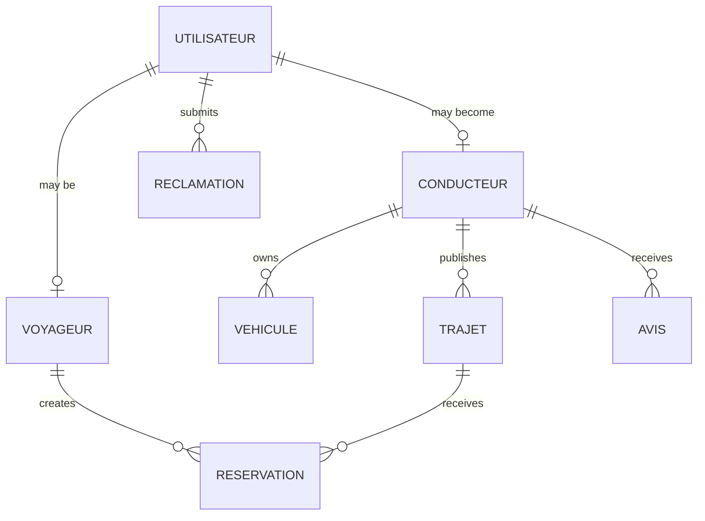

# Carpooling Platform API

[](https://openjdk.org/projects/jdk/17/)
[](https://spring.io/projects/spring-boot)
[](https://www.mysql.com/)
[](#security)

REST API for a role-based carpooling platform. It manages authentication, driver onboarding, vehicles, trip discovery, bookings, ratings, complaints, and administrative supervision.

This repository contains the Spring Boot backend. The complete public project is presented in [carpooling-platform](https://github.com/KhaledZouari/carpooling-platform).

## Key features

- JWT-based registration, login, and stateless authentication
- Traveler, driver, and administrator roles
- Traveler-to-driver account upgrade workflow
- Vehicle management with image upload support
- Trip creation, update, cancellation, and detailed multi-criteria search
- Booking confirmation, rejection, and cancellation workflows
- Driver ratings and reviews
- User complaints with administrative status tracking
- Administrative user moderation, trip management, and platform statistics
- Bean Validation and centralized API error responses
- MySQL persistence with an isolated H2 test database

## Architecture



The code follows a layered structure:

- **Controllers** expose the HTTP API and validate incoming requests.
- **Services** enforce workflow rules and map entities to response DTOs.
- **Repositories** provide persistence through Spring Data JPA.
- **DTOs** define explicit request and response contracts.
- **Security components** authenticate bearer tokens and enforce role-based access.
- **Global exception handling** returns consistent error payloads.

## Technology stack

| Area | Technology |
| --- | --- |
| Runtime | Java 17 |
| Framework | Spring Boot 3.4.4 |
| API | Spring Web, Jakarta Bean Validation |
| Security | Spring Security, JWT, BCrypt |
| Persistence | Spring Data JPA, Hibernate |
| Databases | MySQL, H2 for tests |
| Build and test | Maven, JUnit, Spring Boot Test |
| Utilities | Lombok |

## Domain model



## Getting started

### Prerequisites

- JDK 17
- MySQL 8 or a compatible server
- Maven 3.9+, or the Maven wrapper included in the repository

### 1. Clone the repository

```bash
git clone https://github.com/KhaledZouari/cov-backend.git
cd cov-backend
```

### 2. Configure the environment

Create an empty MySQL database or allow the configured connection URL to create `ihm_cov`. Then define the required variables:

| Variable | Required | Description |
| --- | --- | --- |
| `DB_USERNAME` | Yes | MySQL username |
| `DB_PASSWORD` | Yes | MySQL password |
| `JWT_SECRET` | Yes | Random signing secret containing at least 32 bytes |
| `DB_URL` | No | Full JDBC URL; defaults to local `ihm_cov` |
| `FRONTEND_URLS` | No | Comma-separated CORS allowlist |
| `COV_DEMO_PASSWORD` | Demo only | Password assigned to seeded demo accounts |

Example for Bash:

```bash
export DB_USERNAME="cov_user"
export DB_PASSWORD="change-me"
export JWT_SECRET="$(openssl rand -base64 48)"
export FRONTEND_URLS="http://localhost:5173"
```

Never commit `.env` files or production credentials. The supplied `.env.example` contains names and safe placeholders only.

### 3. Run the API

```bash
./mvnw spring-boot:run
```

On Windows:

```powershell
.\mvnw.cmd spring-boot:run
```

The API starts at `http://localhost:8089` by default.

### Optional demo data

Demo data is disabled during normal execution. To enable the `demo` Spring profile, define `COV_DEMO_PASSWORD` and run:

```bash
SPRING_PROFILES_ACTIVE=demo ./mvnw spring-boot:run
```

Use demo accounts only in local, disposable environments.

## API overview

| Resource | Base path | Main capabilities | Access |
| --- | --- | --- | --- |
| Authentication | `/api/auth` | Register, log in, view/update profile, become a driver | Public login/register; authenticated profile operations |
| Trips | `/api/trajets` | Search, view, create, update, cancel | Public search/details; authenticated mutations |
| Vehicles | `/api/vehicules` | Create, list own vehicles, delete, upload image | Authenticated |
| Bookings | `/api/reservations` | Book, list, confirm, reject, cancel | Authenticated |
| Reviews | `/api/avis` | Submit and list driver reviews | Authenticated |
| Complaints | `/api/reclamations` | Submit and list own complaints | Authenticated |
| Administration | `/api/admin` | Moderate users, trips, complaints, and view statistics | Administrator only |

Send authenticated requests with a bearer token:

```http
Authorization: Bearer <token>
```

### Trip search

`GET /api/trajets` supports optional filters including departure, destination, date, available seats, trip type, smoking and pet preferences, vehicle type, status, price range, driver rating, distance, and departure-time range.

Example:

```bash
curl "http://localhost:8089/api/trajets?depart=Tunis&arrivee=Sousse&places=2&prixMax=30"
```

## Testing

Run the automated test suite with the isolated H2 configuration:

```bash
./mvnw test
```

Build the executable package:

```bash
./mvnw clean verify
```

## Project structure

```text
src/
|-- main/
|   |-- java/com/cov/
|   |   |-- config/       # Security, CORS, web, and demo-data configuration
|   |   |-- controller/   # REST endpoints
|   |   |-- dto/          # Request and response contracts
|   |   |-- enums/        # Roles and workflow states
|   |   |-- exception/    # API exception mapping
|   |   |-- model/        # JPA entities
|   |   |-- repository/   # Data-access interfaces
|   |   |-- security/     # JWT authentication components
|   |   `-- service/      # Business logic
|   `-- resources/        # Application configuration
`-- test/                 # Automated tests
```

## Security

- Passwords are hashed with BCrypt.
- The API is stateless and authenticates requests with JWT bearer tokens.
- Administrative routes require the `ADMIN` role.
- Runtime database credentials and the signing secret are read from environment variables.
- CORS origins are configurable through an explicit allowlist.
- Request DTOs use Jakarta Bean Validation.

For production, use a secrets manager, serve the API exclusively over HTTPS, rotate signing keys, restrict CORS origins, disable verbose SQL logging, use schema migrations instead of `ddl-auto=update`, validate uploaded files, and add rate limiting and security monitoring.

## Contribution workflow

1. Create a focused feature branch.
2. Keep API contracts backward compatible or document intentional breaking changes.
3. Add tests for business rules, authorization boundaries, and failure cases.
4. Run `./mvnw clean verify` before opening a pull request.
5. Use fictitious data in commits, logs, tests, screenshots, and issue reports.

## License

No open-source license has been assigned yet. Copyright remains with the repository owner; public availability does not grant permission to reuse or redistribute the code.

## Author

Developed by [Khaled Zouari](https://github.com/KhaledZouari).
